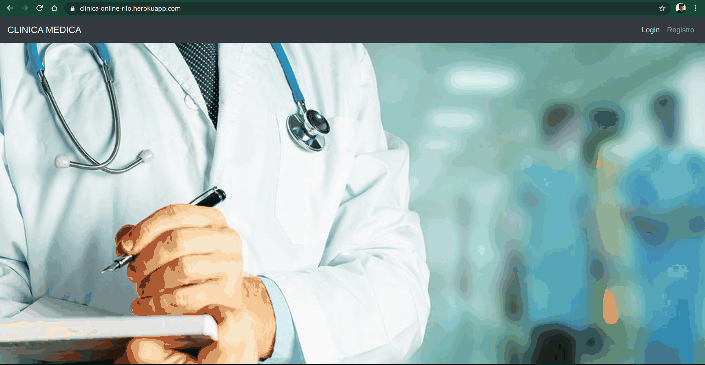
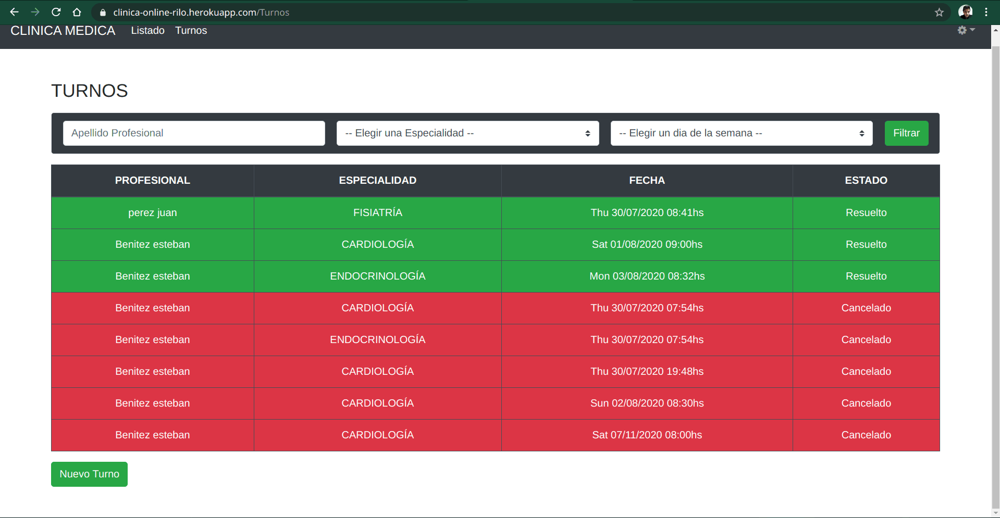
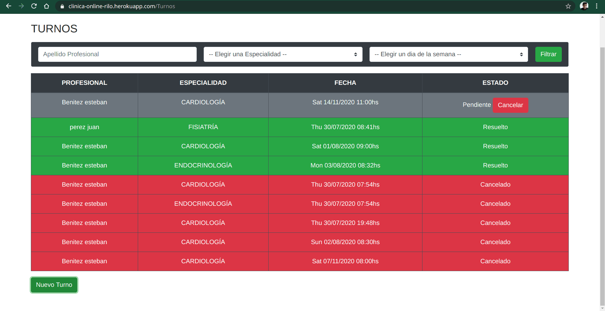

# Clínica Medica

[Clinica medica](https://clinica-online-rilo.herokuapp.com/)

Una clínica online donde los pacientes y los profesionales se registran para el manejo de los turnos solicitados.

## Usuarios
Hay tres tipos de usuarios que interactuan con el sistema:

#### Paciente:
Es el usuario que solicita los turnos en la clínica. solo tiene que registrarse al sistema con algunos datos personales y verificar su cuenta desde su dirección de correo electrónico. luego de eso el Paciente podrá ingresar al sistema para solicitar turnos.

#### Profesional:
Es quien va a atender a los pacientes y realizar las historias clínicas de estos luego de cada turno. Tienen una especialidad en al menos una rama de la medicina y una serie de horarios en los cuales van a poder dar turnos. cada día va a estar cubierto para una especialidad en particular y la duración de los turnos va a depender de dicha especialidad.

#### Admin:
Es el usuario con acceso a toda la información. puede ver todos los usuarios, encuestas, historias clínicas y hasta las notificaciones de todos los usuarios.ademas de esto, también va a poder habilitar a los profesionales y cambiar sus especialidades, y va a poder ver informes de diferentes tipos relacionados al funcionamiento del sistema. Solo puede ser creado por otro administrador.

login a la pagina web

## Registro
Un usuario que deba registrarse deberá completar correctamente el formulario de registro. tendrá la opción de elegir el tipo de usuario que es y definirá sus características propias si este las tiene. el formulario Tendrá 2 captchas presentes (propio y de google) que se podrán habilitar en cualquier momento. 
Una vez completado el registro, el Paciente tendrá que entrar a la cuenta de correo electrónico que paso en el formulario para poder iniciar sesión. el Profesional por otro lado deberá esperar a que uno de los Administradores lo habilite

## Gestión de Turnos
un turno es creado por el Paciente para una fecha en el futuro. el paciente elige al profesional que quiere que lo atienda y a una de sus especialidades. esto va a generar una vista con todos los horarios que se puedan elegir.

una vez elegido el horario se enviara un aviso al profesional de lo sucedido y este tendrá tiempo hasta el día de la fecha estipulada en el turno para aceptarlo o cancelarlo. si lo acepta, el turno cambiara de estado y permanecerá como Aceptado hasta el momento en que llegue a la fecha estipulada en el turno, donde va a cambiar su estado a Preparado.

Si el profesional lo atiende, el turno sera Resuelto, de lo contrario sera considerado Cancelado. al Igual que los Pacientes el Profesional podrá cancelar cualquier turno suyo en cualquier momento pero tendrá que explicar el motivo de cancelación. este motivo se podrá visualizar en la pestaña de notificaciones, donde se almacenan y muestran todos los avisos de operaciones relacionadas a turnos donde participa el usuario;

carga de turno de forma manual

carga de turno usando la funcion de turno rapido

## Generación de la Historia Clínica
Al atender al paciente, el profesional deberá completar una historia clínica 
donde se darán a conocer características del Paciente. se completaran campos obligatorios y otros opcionales utilizando diferentes controles de entrada y finalmente el Profesional dará un breve detalle del turno resuelto. una vez hecho todo esto se generara la historia clínica que podrá ser vista por el Paciente 

## Generación de Encuesta del Paciente
al Resolver un turno, el paciente tendrá la opción de completar una encuesta sobre el desarrollo del mismo. la encuesta se enfocara únicamente en el Profesional que atendió al paciente con el fin de determinar la satisfacción de los usuarios con el personal. una vez Enviada, el Profesional podrá ver esta reseña sobre el. 

## Obtención de Informes
Un Usuario administrador tiene la capacidad de solicitar información en forma de gráficos. el es el único que puede verlos y podrá descargar estos informes. en ellos se muestra información sobre los Profesionales, los Turnos, los Pacientes y el mismo sistema. 

 muestra y descarga de informes

## búsqueda de información
Los Usuarios van a poder entrar en todo momento a una pestaña con diferentes listados para obtener cierta información. un Paciente y un Administrador tienen la capacidad de filtrar estos listados hasta quedar satisfechos con la búsqueda hecha. 
estos listados son de Usuarios, de Historias Clinicas y de Encuestas
